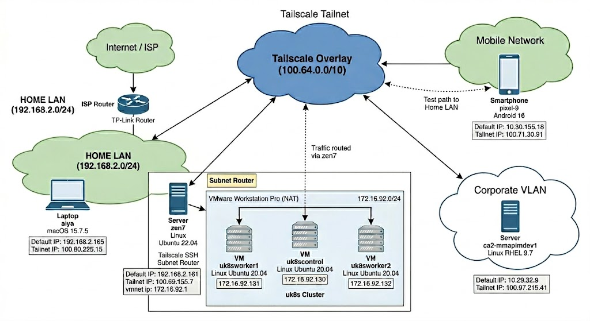

<!-- omit from toc -->
# Tailscale SSH and Subnet Router Installation and Configuration

<!-- omit from toc -->
## Table of Contents
- [Tailnet](#tailnet)
- [Home Lab](#home-lab)
  - [Network Diagram](#network-diagram)
  - [Router](#router)
  - [Linux Server](#linux-server)
  - [Google Pixel Phone](#google-pixel-phone)
  - [RHEL Server](#rhel-server)
  - [MacBook Pro Laptop](#macbook-pro-laptop)
- [Tailscale Installations](#tailscale-installations)
- [Tailscale SSH Installation and Configuration](#tailscale-ssh-installation-and-configuration)
  - [Using Tailscale APIs](#using-tailscale-apis)
- [Tailscale Subnet Router Installation and Configuration](#tailscale-subnet-router-installation-and-configuration)
- [TL;DR](#tldr)
  - [Automated Provisioning Solution](#automated-provisioning-solution)
  - [Pre-Requisites](#pre-requisites)
  - [Run Vagrant](#run-vagrant)
  - [Test Subnet Routes](#test-subnet-routes)
- [Assignment Q+A](#assignment-qa)
- [Mind-Blown Examples](#mind-blown-examples)

This README and the included repository assets provide details for the installation and configuration of Tailscale SSH and a subnet router on a tailnet node in a home lab environment. Although the instructions are specific to a home lab, they apply equally well to a client scenario where secure access to a protected resource in a restricted subnet is required.

## Tailnet

The tailnet in use is taild8e80e.ts.net and is composed of 4 nodes:

| node           | default ip    | default ip network | tailnet ip address | os type        | os version  | notes                |
| :------------- | :------------ | :----------------- | :----------------- | :------------- | :---------- | :------------------- |
| zen7           | 192.168.2.161 | home lan           | 100.69.155.7       | Linux - Ubuntu | 22.04.5 LTS | vmnet ip 172.16.92.1 |
| pixel-9        | 10.30.155.18  | mobile network     | 100.71.30.91       | Android        | 16          |                      |
| aiya           | 192.168.2.165 | home lan           | 100.80.225.15      | macOS          | 15.7.5      |                      |
| ca2-mmapimdev1 | 10.29.32.9    | corporate vlan     | 100.97.215.41      | Linux - RHEL   | 9.7         |                      |

zen7 was the first node added to the tailnet and is running Tailscale SSH and a subnet router.


## Home Lab

In addition to zen7, pixel-9, and aiya, the home lab environment also has an older Kubernetes cluster available:

| node        | default ip    | default ip network | tailnet ip address | os type        | os version  | notes                |
| :---------- | :------------ | :----------------- | :----------------- | :------------- | :---------- | :------------------- |
| uk8scontrol | 172.16.92.130 | vmnet NAT          |                    | Linux - Ubuntu | 20.04.5 LTS | behind subnet router |
| uk8sworker1 | 172.16.92.131 | vmnet NAT          |                    | Linux - Ubuntu | 20.04.5 LTS | behind subnet router |
| uk8sworker2 | 172.16.92.132 | vmnet NAT          |                    | Linux - Ubuntu | 20.04.5 LTS | behind subnet router |

### Network Diagram

The diagram below provides a holistic view of the home lab and all tailnet nodes.




### Router
The home router in use is a TP-Link Archer A10 AC2660 router. Port 22 was opened to allow SSH access to the zen7 Linux server.

### Linux Server
The first node added to the tailnet, zen7, is a Linux server running a supported and up-to-date version of Ubuntu. It has an openssh-server running on port 22 and ufw is enabled with a limit for SSH connections. SSH is configured with no root access and only one system user, michael, is an allowed user:

```
# Authentication:

PermitRootLogin no
AllowUsers michael
```

zen7 also has VMware Workstation 17 Pro installed as a hypervisor and an old Kubernetes cluster is available (3 virtual machines with 1 control and 2 workers). The cluster plays the role of a protected subnet resource.

### Google Pixel Phone
A Google Pixel 9 phone, pixel-9, was added to the tailnet to test connections from a node on a mobile network and with a different operating system. Once connected to the tailnet, zen7 SSH connection tests were performed, resulting in mind-blown moments:

[mind-blown moment#1](#mb1) <br>
[mind-blown moment#2](#mb2)

### RHEL Server
A Red Hat Enterprise Linux server, ca2-mmapimdev1, deployed in Azure within a corporate network was also added to the tailnet to test connections from a network outside of the home lab. Once again, exciting things were discovered:

[mind-blown moment#3](#mb3)

### MacBook Pro Laptop
A MacBook Pro, aiya, running a supported and up-to-date version of macOS was added to the tailnet to perform tests of the Tailscale SSH and subnet router connections. The laptop effectively played the role of a client connecting to tailnet node resources.


## Tailscale Installations

Installation of tailscale on all nodes was performed as per the excellent tailscale documentation:
 - [Linux installations](https://tailscale.com/docs/install/linux)
 - [Android installation](https://tailscale.com/docs/install/android)
 - [macOS installations (Standalone variant)](https://tailscale.com/docs/install/mac)

## Tailscale SSH Installation and Configuration

zen7 was chosen as the node to enable tailscale SSH. As per the [documentation](https://tailscale.com/docs/features/tailscale-ssh), setup was done by issuing the following command as root:

```bash
tailscale set --ssh
```
[mind-blown moment#4](#mb4)

The tailnet policy file was initially not modified, however, when it was noticed during testing that SSH as a root user was allowed to nodes, a configuration change was made to restrict access to one user, michael. Also, the default check duration was extended to 48 hours. Here is the relevant ssh section of the tailnet policy that was modified:

```json
"ssh": [
    {
        "action": "check",
        "src": [ "autogroup:member" ],
        "dst": [ "autogroup:self" ],
        "users": [ "michael" ],
        "checkPeriod": "48h"
    }
],
```
In addition, it is important to note that the default grants section in the tailnet policy file is very permissive:

```json
"grants": [
    {
        "src": [ "*" ],
        "dst": [ "*" ],
        "ip": [ "*" ]
    }
],
```

The grants section was intentionally left un-modified to allow for ease of testing. In a production environment, much greater attention and detail must be paid to the tailnet policy file to adhere to principles of least privilege and zero trust security.

[mind-blown moment#5](#mb5)

### Using Tailscale APIs

The [Tailscale API](https://tailscale.com/api) provides a convenient option for managing tailnet policies via the tailnet API acl endpoint:

tailnet/{tailnet}/acl

During testing a GET request was sent to read the policy file (note that the full access token string is not shown for security purposes):

```bash
curl 'https://api.tailscale.com/api/v2/tailnet/taild8e80e.ts.net/acl' \
  --header 'Authorization: Bearer tskey-api-{unique_access_token_string}'
```
and a POST request to write (or set) the policy file was sent to update the Tailscale SSH checkPeriod:

```bash
curl 'https://api.tailscale.com/api/v2/tailnet/taild8e80e.ts.net/acl' \
  --request POST \
  --header 'Content-Type: application/json' \
  --header 'Authorization: Bearer tskey-api-{unique_access_token_string}' \
  --data-binary '{
    "grants": [
        {
            "src": [ "*" ],
            "dst": [ "*" ],
            "ip": [ "*" ]
        }
    ],
    "ssh": [
        {
            "action": "check",
            "src": [ "autogroup:member" ],
            "dst": [ "autogroup:self" ],
            "users": [ "michael" ],
            "checkPeriod": "96h"
        }
    ]
}'
```
The Tailscale API is an excellent resource to leverage when incorporating automation and CI/CD pipelines into a Tailscale deployment. 

## Tailscale Subnet Router Installation and Configuration

zen7 was setup as a subnet router to permit tailnet access to an older Kubernetes cluster implemented as 3 VMs in VMware Workstation Pro. Each VM uses a NAT'ed network connection and setting up a subnet router on zen7 was an easy way to allow access to the cluster from other tailnet nodes. The Tailscale [subnet router documentation](https://tailscale.com/docs/features/subnet-routers) was followed for the setup. The commands issued as root on zen7 were:

```bash
echo 'net.ipv4.ip_forward = 1' | sudo tee -a /etc/sysctl.d/99-tailscale.conf
echo 'net.ipv6.conf.all.forwarding = 1' | sudo tee -a /etc/sysctl.d/99-tailscale.conf
sysctl -p /etc/sysctl.d/99-tailscale.conf
tailscale set --advertise-routes=172.16.92.0/24

```
The subnet routes were then enabled from the tailnet admin console and the solution was working as expected. For example, from the macOS node, aiya, a ping to 172.16.92.130 (uk8scontrol) returned a response:

```
aiya:~ michael$ ping 172.16.92.130
PING 172.16.92.130 (172.16.92.130): 56 data bytes
64 bytes from 172.16.92.130: icmp_seq=0 ttl=63 time=8.780 ms
64 bytes from 172.16.92.130: icmp_seq=1 ttl=63 time=3.918 ms
64 bytes from 172.16.92.130: icmp_seq=2 ttl=63 time=3.806 ms
```
and a successful SSH connection was permitted as the user michael:

```
aiya:~ michael$ ssh 172.16.92.130
michael@172.16.92.130's password: 
Welcome to Ubuntu 20.04.5 LTS (GNU/Linux 5.4.0-131-generic x86_64)

 * Documentation:  https://help.ubuntu.com
 * Management:     https://landscape.canonical.com
 * Support:        https://ubuntu.com/advantage

  System information as of Thu 26 Mar 2026 02:31:19 AM UTC

  System load:  0.08               Processes:                238
  Usage of /:   51.8% of 18.53GB   Users logged in:          1
  Memory usage: 30%                IPv4 address for docker0: 172.17.0.1
  Swap usage:   0%                 IPv4 address for ens33:   172.16.92.130

 * Ubuntu 20.04 LTS Focal Fossa has reached its end of standard support
   on 31 May 2025.

   For more details see:
   https://ubuntu.com/20-04

88 updates can be applied immediately.
To see these additional updates run: apt list --upgradable

New release '22.04.5 LTS' available.
Run 'do-release-upgrade' to upgrade to it.


*** System restart required ***
Last login: Thu Mar 26 02:07:02 2026
michael@uk8scontrol:~$
```

When testing access to the Kubernetes cluster from the RHEL Server, ca2-mmapimdev1, an extra configuration was required to enable automatic discovery of new subnet routes:

```bash
sudo tailscale set --accept-routes
```

[mind-blown moment#6](#mb6)


## TL;DR

The above sections detail my journey with Tailscale and the setup of Tailscale SSH and a subnet router. If, however, a faster, more automated solution is desired to setup the functionality on a new tailnet node, the following solution can be leveraged:

### Automated Provisioning Solution

Vagrant was also installed on zen7 to automatically provision an Ubuntu virtual machine in order to demonstrate how quickly a node can be provisioned and configured with Tailscale SSH and as a subnet router.

### Pre-Requisites
 - Install vagrant on zen7 along with the Vagrant VM Utility and the Vagrant VMware Desktop Plugin
 - Create a Tailscale Auth Key in the Tailscale Admin Console
 - Add an autoApprovers section to the Tailscale policy file:

```json
"autoApprovers": {
  "routes": {
    "172.16.92.0/24": ["autogroup:member"]
  }
}
```
 - Copy tailscale_setup.sh and Vagrantfile to a working directory

**Note:** The full string for the auth key in the setup script is not included for security purposes.

### Run Vagrant
 - In the working directory issue the following vagrant command:

```bash
vagrant up --provider vmware_desktop
```

### Test Subnet Routes
 - Turn off routes on zen7
  
```bash
sudo tailscale set --advertise-routes=""
```

 - from aiya or ca2-mmapimdev1 ping 172.16.92.130 (i.e., uk8scontrol)
 - from aiya or ca2-mmapimdev1 ssh to 172.16.92.130 (i.e., uk8scontrol)

The ping and ssh connection should both be successful!

Vagrantfile
 - sets the new node hostname
 - configures vmware bridged networking
 - creates a new user, michael
 - provisions the tailscale_setup.sh script

tailscale_setup.sh
 - installs Tailscale
 - enables Tailscale SSH
 - enables IP forwarding
 - advertises subnet routes
 - sets michael as a Tailscale operator

New Tailscale Node:

| node    | default ip    | default ip network | tailnet ip address | os type        | os version  | notes                      |
| :------ | :------------ | :----------------- | :----------------- | :------------- | :---------- | :------------------------- |
| tsubu22 | 192.168.2.170 | vmnet bridged      | 100.95.89.43       | Linux - Ubuntu | 24.04.3 LTS | vmnet nat ip 172.16.92.133 |


## Assignment Q+A

As part of the assignment, there were several questions presented in the instructions:

Why did you chose this approach?
 - I wanted to install and test Tailscale on multiple OSes (Ubuntu, RHEL, macOS, Android).
 - I wanted to use multiple network environments (i.e., home NAT, VM NAT, mobile, corporate).
 - My personal preference is to use Linux and setting up Tailscale SSH and a subnet router on my home Linux server was very straightforward. 

What would you improve with more time?
 - My next step with this solution would be to configure the tailnet policy with more fine-grained controls to enhance security.
 - Even though it was very easy to install Tailscale and enable features with straightforward commands, setting up an Ansible server to automate node configuration is another enhancement to this solution. In a production environment with hundreds or thousands of nodes an automated solution like Ansible would be a requirement.

What best practices would you recommend to a customer deploying this in production?
 - Fine-tune the Tailscale policy file to enhance security and enable fine-grained controls over which users and nodes have access to which resources.
 - Deploy the Tailscale Kubernetes Operator to the Kubernetes cluster to add the cluster to the Tailnet.
 - Deploy an Ansible server to handle the installation and configuration of Tailscale on nodes.
 - Create test suites to ensure the tailnet is configured as expected to ensure the desired access to each type of service or resource is what was intended.
 - Place the Tailscale policy file under version control.

Were any AI/LLM tools used for the assignment?
 - I used Google Gemini for assistance with the syntax of this README.md file (e.g., table of contents, table formatting) and to help ensure it would render well in GitHub.
 - I used Google Gemini to produce my network diagram by providing the tailnet and Home Lab node tables in this document, along with some additional prompts for what I wanted it to look like.
 - I also used Google Gemini to assist with the installation of vagrant on zen7, creation of the Vagrantfile, and creation of the tailscale_setup.sh bash script.


## Mind-Blown Examples

1. <span id="mb1"></span> Issue the command `ping zen7` from pixel-9 on the mobile network and receive a response - no DNS configuration required!
2. <span id="mb2"></span> Closing port 22 on the home router and still being able to SSH to zen7 remotely from pixel-9 on the mobile network - wow!
3. <span id="mb4"></span> Access corporate RHEL Server, ca2-mmapimdev1, from zen7 with no corporate VPN connection required - insane!
4. <span id="mb3"></span> zen7 /var/log/auth.log SSH "door-knocking" goes silent for the first time in years - joy!
5. <span id="mb5"></span> After Tailscale SSH was setup on zen7, an ephemeral SSH Connection to zen7 from within the tailnet control plane was available - how convenient!
6. <span id="mb6"></span> Able to SSH to uk8scontrol from a separate private network - no networking efforts required!


